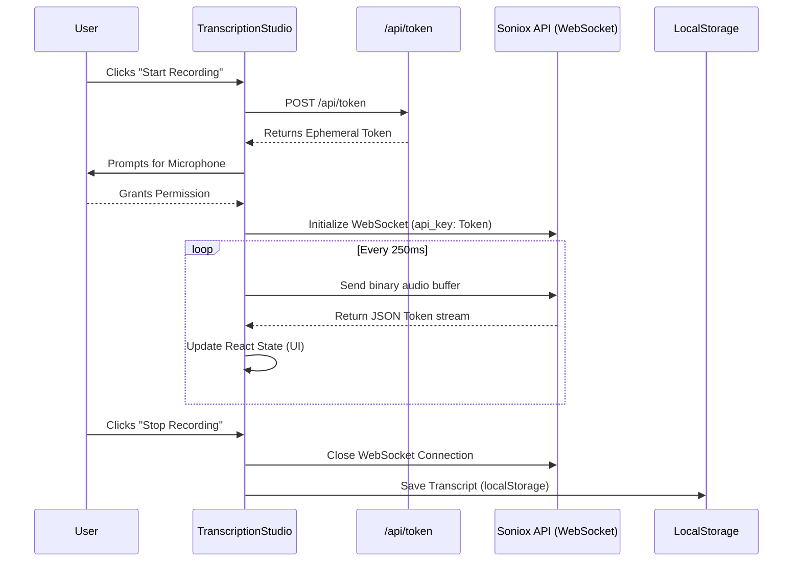

# Soniox Real-Time Transcription App Architecture

This document outlines the architecture, data flow, and honest limitations of the Soniox Real-Time Transcription application. 

## Section 1: System Context & Overview

- **Goal:** A Next.js App Router application demonstrating real-time transcription using the Soniox API.
- **Tech Stack:** Next.js 16+, React 19, Vanilla CSS, Soniox JS SDK (`@soniox/client` and `@soniox/node`), and browser LocalStorage.
- **Scope & Limitations:** This is a frontend-heavy application. It relies entirely on client-side storage (no external database) and uses a **mocked** usage endpoint. It is designed to demonstrate real-time audio streaming and component organization rather than production-ready backend infrastructure.

## Section 2: Containers & Core Components

### Backend (Next.js API Routes)
- `/api/token`: Uses the `@soniox/node` SDK to securely exchange the root `SONIOX_API_KEY` for a 1-hour ephemeral token. The SDK method used is `createTemporaryKey` with the required `usage_type: "transcribe_websocket"`.
- `/api/usage`: **Note: This endpoint currently returns mocked static data** (e.g., 7200 seconds, $3.00 estimated cost). The Soniox Node SDK does not expose a standard usage metric endpoint natively. Future iterations looking to capture real metrics would need to track local token limits or utilize undocumented Soniox REST endpoints.

### Frontend Components
- `TranscriptionStudio.tsx`: The core studio interface. Uses `navigator.mediaDevices.getUserMedia` to capture audio via `MediaRecorder`. It streams binary array chunks to the Soniox WebSocket via `client.realtime.stt()` and listens to the `session.on('result')` event to update the React state with live transcribed text.
- `Library.tsx` & `lib/storage.ts`: Handles strictly local CRUD operations. The user's transcripts are saved to and read from the browser's `localStorage`.
- `CostDashboard.tsx`: Displays the mocked usage data fetched from `/api/usage`.

## Section 3: Data Flow Diagram

